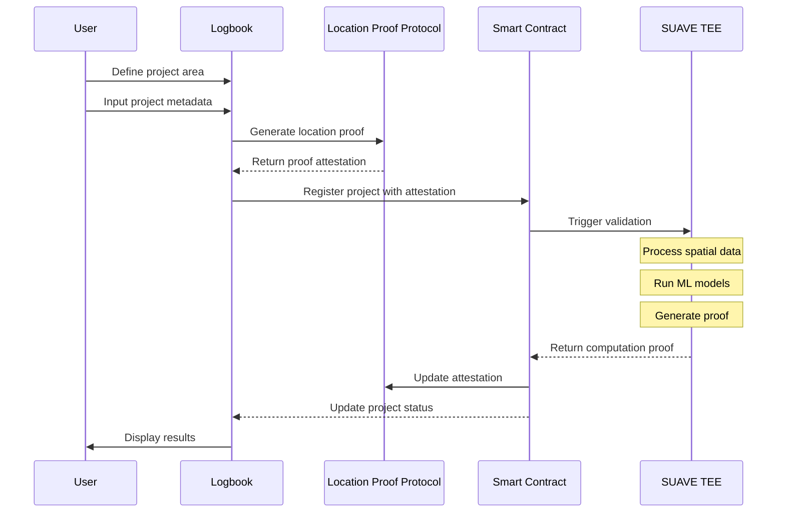

# Proof of Change

A decentralized GIS platform that verifies and validates real-world environmental impact through SUAVE confidential compute, satellite imagery analysis, and blockchain attestations, powered by Astral Protocol's Logbook and Location Proof Protocol.

## Overview

Proof of Change combines SUAVE trusted execution environments (TEEs), machine learning, and Astral Protocol's Logbook to provide cryptographic proof of environmental impact. Project creators can map their impact zones using Astral's interface and leverage ML-powered analysis tools to process historical satellite data, creating verifiable proof of their environmental contributions through the Location Proof Protocol.

## Pitch Deck

<embed src="pitch-deck.pdf" type="application/pdf" width="100%" height="600px" />

## System Architecture

### Data Flow
1. Frontend Collection (Astral Logbook)
   - Project area definition
   - Metadata input
   - Location proof generation

2. Data Processing
   - Boundary storage in IPFS
   - Project registration in smart contracts
   - EAS attestation generation
   - SUAVE computation trigger

3. Verification Process
   - SUAVE TEE processes spatial data
   - Generates computation proof
   - Smart contract verifies proof
   - Updates project status

## Key Components

### Impact Rewards System

The platform includes a comprehensive rewards mechanism to incentivize and fund successful environmental projects:

1. **Retroactive Funding**
   - Projects are funded based on verified outcomes
   - Reward pool backed by environmental impact investors
   - Automated distribution based on impact metrics

2. **Outcome-based Incentives**
   - Rewards scaled to quantified impact
   - Verified by SUAVE computation results
   - Transparent scoring mechanism

3. **Proof of Impact**
   - Cryptographic proof of verified environmental impact
   - Based on SUAVE computation results
   - Immutable record of achievements
   - Foundation for reward claims

4. **Reward Distribution**
   - Smart contract-based automated payments
   - Multi-tier reward structure
   - Performance-based scaling
   - Regular distribution cycles

### Frontend Layer
- Astral Logbook for spatial data interaction
- Location Proof Protocol integration
- Web3 integration for blockchain interaction

### Processing Layer
- SUAVE TEE for secure computation
- ML model execution in confidential compute
- Spatial data processing
- Zero-knowledge proof generation
- Multi-party computation (MPC) validation

### Blockchain Layer
- Ethereum smart contracts
- EAS integration for attestations
- Custom schema registry
- Verification logic

### Impact Rewards Layer
- Retroactive funding pool
- Proof of Impact verification
- Reward distribution system
- Outcome-based incentive mechanisms

### Verification Layer
- Location Proof Protocol (LPP)
- EAS attestations through Astral
- Custom verification logic
- Proof validation

### Hybrid TEE-MPC Architecture

#### TEE Layer (SUAVE)
Core ML model execution remains in SUAVE's TEE for:
- Satellite image processing
- Change detection models
- Feature extraction

Benefits:
- Maintains confidentiality of ML model parameters
- Efficient execution of complex computations
- Provides computation proofs

#### MPC Validation Layer
Distributes validation across multiple independent validators. Each validator runs MPC protocol to:
- Verify input data integrity
- Validate model outputs
- Check computation proofs

MPC consensus ensures:
- No single validator can manipulate results
- Validation process is transparent
- Higher trust in the verification process

## Roadmap

### Phase 1 - MVP (Current)
- [x] Astral Logbook integration
- [x] Location Proof Protocol integration
- [x] Basic project registration
- [ ] Initial TEE implementation

### Phase 2 - Core Features
- [ ] SUAVE TEE integration
- [ ] ML model implementation
- [ ] Proof generation
- [ ] Verification system

### Phase 3 - Impact Rewards
- [ ] Retroactive funding mechanism
- [ ] Impact proof generation
- [ ] Reward distribution system
- [ ] Outcome verification metrics

### Phase 4 - Advanced Features
- [ ] Complex spatial analysis
- [ ] Time series processing
- [ ] Custom ML models
- [ ] Advanced verification schemes

## License

This project is licensed under the MIT License - see the [LICENSE](LICENSE) file for details.
