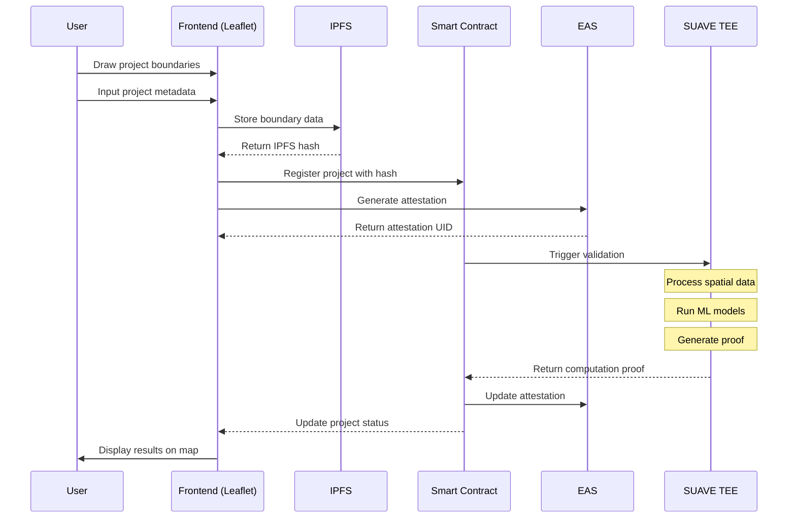

# Proof of Change

A decentralized GIS platform that verifies and validates real-world environmental impact through SUAVE confidential compute, satellite imagery analysis, and blockchain attestations.


## Overview

Proof of Change combines SUAVE trusted execution environments (TEEs), machine learning, and Leaflet.js to provide cryptographic proof of environmental impact. Project creators can map their impact zones and leverage ML-powered analysis tools to process historical satellite data, creating verifiable proof of their environmental contributions.

## System Architecture



### Data Flow
1. Frontend Collection (Leaflet.js)
   - Project boundary drawing
   - Metadata input
   - Feature collection

2. Data Processing
   - Boundary storage in IPFS
   - Project registration in smart contracts
   - EAS attestation generation
   - SUAVE computation trigger

3. Verification Process
   - SUAVE TEE processes spatial data
   - Generates computation proof
   - Smart contract verifies proof
   - Updates project status

## Key Components

### Impact Rewards System

The platform includes a comprehensive rewards mechanism to incentivize and fund successful environmental projects:

1. **Retroactive Funding**
   - Projects are funded based on verified outcomes
   - Reward pool backed by environmental impact investors
   - Automated distribution based on impact metrics

2. **Outcome-based Incentives**
   - Rewards scaled to quantified impact
   - Verified by SUAVE computation results
   - Transparent scoring mechanism

3. **Proof of Impact**
   - Cryptographic proof of verified environmental impact
   - Based on SUAVE computation results
   - Immutable record of achievements
   - Foundation for reward claims

4. **Reward Distribution**
   - Smart contract-based automated payments
   - Multi-tier reward structure
   - Performance-based scaling
   - Regular distribution cycles

### Frontend Layer
- Leaflet.js for spatial data interaction
- React/Next.js application framework
- Web3 integration for blockchain interaction
- IPFS client for data storage

### Processing Layer
- SUAVE TEE for secure computation
- ML model execution in confidential compute
- Spatial data processing
- Zero-knowledge proof generation

### Blockchain Layer
- Ethereum smart contracts
- EAS integration for attestations
- Custom schema registry
- Verification logic

### Impact Rewards Layer
- Retroactive funding pool
- Proof of Impact verification
- Reward distribution system
- Outcome-based incentive mechanisms


## Usage

### 1. Project Registration
```javascript
// Draw project boundary and submit
const project = await ProofOfChange.submitProject({
  boundary: geojsonData,
  metadata: {
    name: "Forest Restoration",
    type: "reforestation"
  }
});
```

### 2. Data Processing
```javascript
// Trigger SUAVE computation
const computation = await project.processSpatialData({
  type: "changeDetection",
  timeframe: "2020-2024"
});
```

### 3. Verification
```javascript
// Verify computation proof
const verification = await project.verifyProof(computation.proof);
```

### 4. Impact Rewards
```javascript
// Generate impact proof for verified project
const impactProof = await project.generateImpactProof({
  verificationId: verification.id,
  impactMetrics: {
    area: "1000ha",
    timeframe: "2020-2024",
    impactType: "reforestation"
  }
});

// Claim rewards from funding pool
const rewards = await project.claimRewards({
  proofId: impactProof.id,
  verification: verification.proof
});
```

## Development Workflow

### Frontend Development
1. Start the development server
```bash
npm run dev
```

2. Initialize Leaflet map
```javascript
const map = L.map('map').setView([0, 0], 2);
L.tileLayer('https://{s}.tile.openstreetmap.org/{z}/{x}/{y}.png').addTo(map);
```

3. Enable drawing controls
```javascript
const drawControl = new L.Control.Draw({
  draw: {
    polygon: true,
    marker: false
  }
});
map.addControl(drawControl);
```

### Smart Contract Interaction
1. Project registration
```solidity
function registerProject(
    bytes32 boundaryHash,
    string memory metadata
) external returns (uint256 projectId);
```

2. SUAVE computation trigger
```solidity
function triggerComputation(
    uint256 projectId,
    bytes memory computationParams
) external returns (bytes32 computationId);
```

## Roadmap

### Phase 1 - MVP (Current)
- [x] Leaflet.js integration
- [x] Basic project registration
- [ ] IPFS storage implementation
- [ ] EAS schema definition

### Phase 2 - Core Features
- [ ] SUAVE TEE integration
- [ ] ML model implementation
- [ ] Proof generation
- [ ] Verification system

### Phase 3 - Impact Rewards
- [ ] Retroactive funding mechanism
- [ ] Impact proof generation
- [ ] Reward distribution system
- [ ] Outcome verification metrics

### Phase 4 - Advanced Features
- [ ] Complex spatial analysis
- [ ] Time series processing
- [ ] Custom ML models
- [ ] Advanced verification schemes


## License

This project is licensed under the MIT License - see the [LICENSE](LICENSE) file for details.
